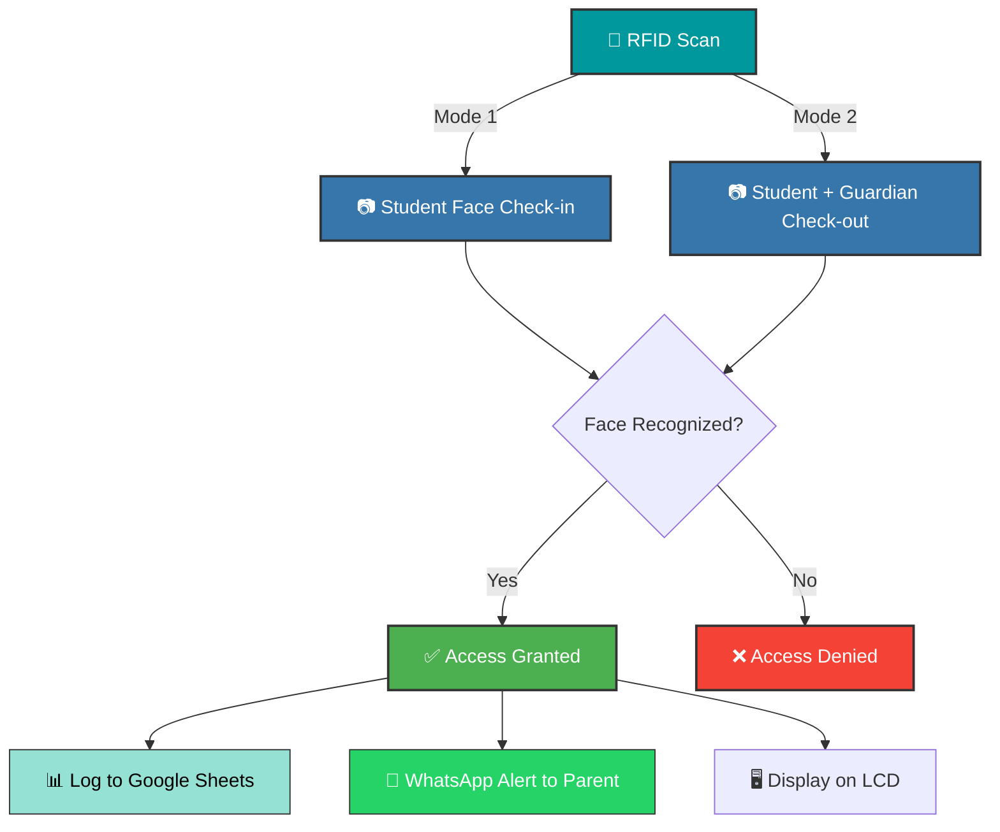

<div align="center">

# 🛡️ AI-Based Child Safety System

> **Intelligent RFID & Facial Recognition for Child Safety**


<br/>

An intelligent attendance and safety system that combines **RFID authorization**, **AI-powered facial recognition**, and **guardian verification** to ensure children's safety during check-in and check-out procedures. It keeps parents updated in real-time via WhatsApp and syncs logs securely to Google Sheets.

</div>

<hr/>

## 🚀 Quick Setup

### 1️⃣ Clone & Install Requirements
```bash
git clone https://github.com/somesh-opps/AI-Based-Child-Safety-System.git
cd AI-Based-Child-Safety-System

# Install core dependencies
pip install cmake dlib face-recognition
pip install -r requirements.txt
```

### 2️⃣ Hardware & Cloud Setup
- 🔌 **Arduino:** Upload the MFRC522 RFID sketch to your Arduino and connect it via USB.
- ☁️ **Google Cloud:** Enable **Google Sheets & Drive APIs** in the Google Cloud Console and download your service account `key.json`.
- 💬 **WhatsApp:** Make sure **WhatsApp Web** is logged in on your primary Chrome browser.

### 3️⃣ Configure Environment
```bash
cp .env.example .env
```
Open `.env` and fill in your details:
- **Arduino COM port**
- **Authorized RFID card IDs**
- **Paths** to your Google credentials and `STUDENTS/` directory

### 4️⃣ Prepare Student Data
Create a folder structure for each student to hold their photos and their guardian's photos for recognition:
```text
STUDENTS/
├── Student_Name/
│   ├── photo1.jpg
│   ├── phone.txt (Parent's WhatsApp number)
│   └── guardian/
│       └── mother.jpg
```

### 5️⃣ Start the System
```bash
python main_rfid_control.py
```
> *🎉 Your safety system is now live! Simply scan an RFID card to begin the check-in or check-out process.*

<hr/>

## 🏗️ How It Works

<div align="center">



</div>

<hr/>

## 📄 License

This project is licensed under the **MIT License**.

> Copyright (c) 2026 Somesh Kumar Sahoo
> 
> Permission is hereby granted, free of charge, to any person obtaining a copy of this software and associated documentation files... *(See the [LICENSE](LICENSE) file for the full text.)*

<br/>

<div align="center">
<b>Made with ❤️ for Child Safety</b>
</div>
